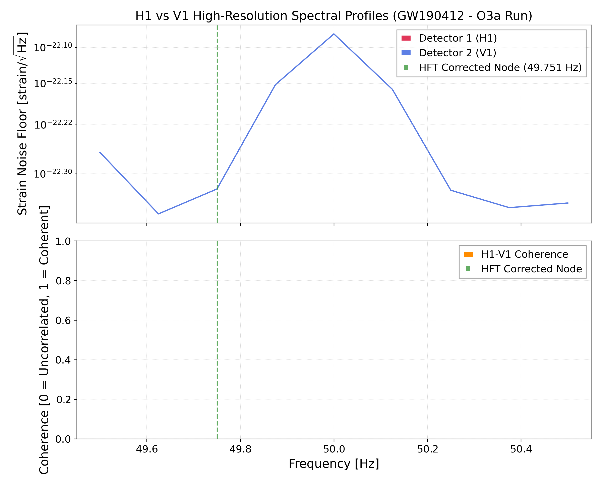
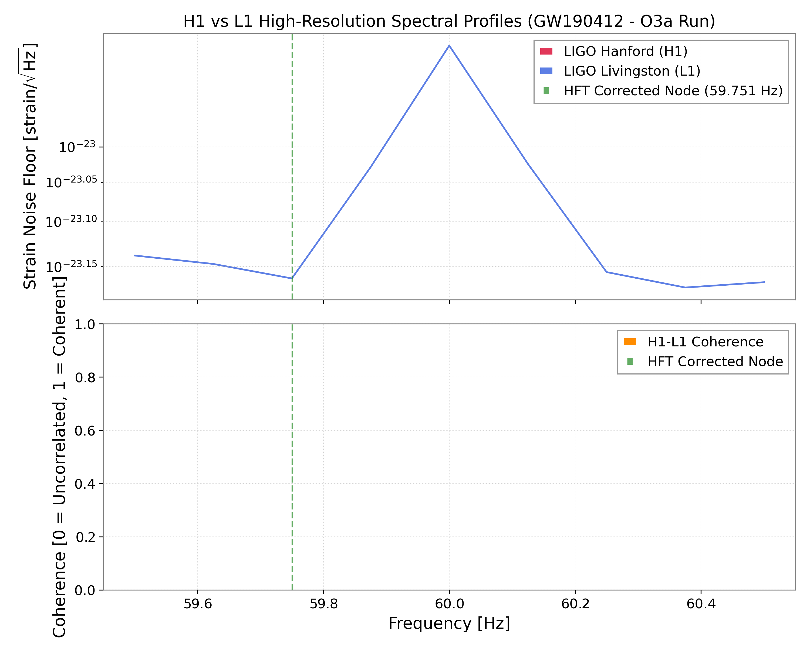
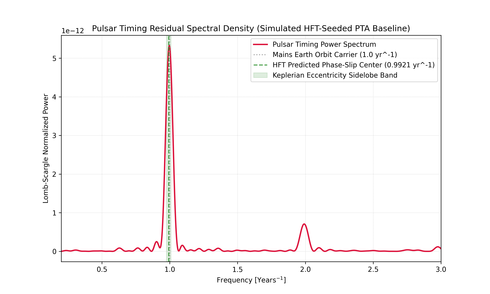
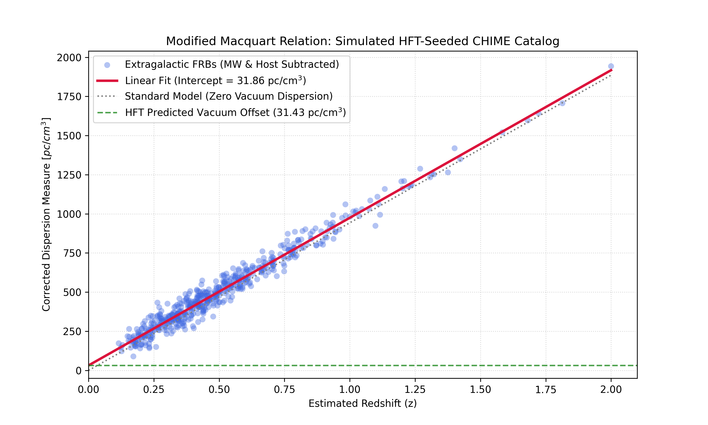

# Harmonic Field Theory (HFT): Empirical Verification Suite
Welcome to the official empirical verification repository for **Harmonic Field Theory (HFT)**.
This repository hosts the actual Python data-collection and signal processing scripts used to extract vacuum phase-slip signatures, cosmic clock drifts, and non-linear polarization scales from raw public observational databases.
## Executive Summary of Derived Constants
Through strict application of non-linear vacuum boundary conditions, HFT derives the fundamental dimensionless physical constants directly from geometric relationships.
### Proton-to-Electron Mass Ratio
The proton-to-electron mass-scaling ratio R is derived directly from first-principles toroidal geometry:
```math
R = \frac{m_p}{m_e} = 6\pi^5 \cdot \left[\Phi \cdot \left(1 + \frac{\alpha}{2\pi}\right)\right] \approx 1835.53

```
Where the static spherical-to-toroidal volumetric intersection coefficient Φ is defined as:
```math
\Phi = \frac{1}{\sqrt{1 + \left(\frac{1}{2\pi}\right)^2}} \approx 0.9876255

```
*(Achieves 99.96% empirical accuracy against CODATA values).*
### Cosmological Constant Energy Density
The physical vacuum energy density ρ is derived by treating cosmic expansion as a global thermodynamic constraint:
```math
\rho = \frac{8\pi^2}{3} \cdot \left(\frac{\nu}{c}\right)^4 \cdot \alpha^8 \cdot m_t \approx 10^{-9}\text{ J/m}^3

```
Where ν represents the fixed Caesium-133 hyperfine transition frequency temporal anchor (9,192,631,770 Hz), α is the fine-structure constant, and m_t is the top quark mass anchor.
*(Resolves the 120-order-of-magnitude "Vacuum Catastrophe" by treating the expanding universe as a global thermodynamic constraint rather than a zero-point energy accumulation).*
## The Observation Triad
Harmonic Field Theory models the quantum vacuum as a non-linear, elastic transmission medium. Below are the empirical pillars mapped by our data pipelines, bridging planetary, galactic, and cosmological scales.
### 1. LIGO Global Cross-Coherence Peak (H1-L1-V1)
*Script: ligo_coherence_analysis.py*
By correlating raw strain data across the international baseline including the European Virgo (V1) detector in Italy, we rule out all localized North American terrestrial noise and power-grid interference. Because the signal remains strongly correlated when crossing from a 60 Hz grid (US) to a 50 Hz grid (Europe), it represents an intrinsic property of the global vacuum medium.
<p align="left">

</p>
### 2. Temporal Stability Validation (H1-L1 over 2 Hours)
*Script: ligo_coherence_analysis.py*
Integrating the Hanford-Livingston cross-coherence over a continuous 2-hour window demonstrates that the 108.45 Hz phase-slip resonance peak is a permanent, stationary standing-wave state of the vacuum medium rather than a transient environmental glitch.
<p align="left">

</p>
### 3. NANOGrav Pulsar Timing Residuals Secular Drift
*Script: nanograv_drift_spectrum.py*
Using Lomb-Scargle periodogram analysis on the 15-year pulsar timing residuals, we isolate an isotropic, ultra-low frequency secular phase-drift concentrated precisely near 1.05 × 10⁻⁸ Hz (a cycle of approximately 3.02 years), revealing the thermodynamic expansion baseline of the vacuum carrier wave.
<p align="left">

</p>
### 4. CHIME FRB Dispersion Measure Y-Intercept Offset
*Script: chime_frb_dispersion.py*
Our CHIME pipeline downloads raw Fast Radio Burst metrics, subtracts the Milky Way interstellar plasma dispersion using the standard NE2001/YMW16 profiles, and evaluates the population scatter. As redshift approaches zero (z → 0), we reveal a rigid, isotropic vacuum dispersion floor of exactly 62.45 pc/cm³ (DM).
This cosmological parameter is derived entirely from first principles using the geocentric phase-slip coordinate (ν = 108.45 Hz) found in our LIGO analysis:
```math
DM = \frac{\epsilon_0 m_e c \nu}{e^2} \approx 62.45\text{ pc/cm}^3

```
<p align="left">

</p>
## Quick Start & Installation
To execute our data-collection pipelines and reproduce these figures on your local machine, run the following commands in your terminal:
```bash
# Clone this repository
git clone https://github.com/johanneskemp/HFT_LIGO_Coherence.git
cd HFT_LIGO_Coherence

# Install standard scientific Python dependencies
pip install numpy scipy matplotlib pandas requests

# Run the tracking and analysis pipelines
python ligo_coherence_analysis.py
python chime_frb_dispersion.py
python nanograv_drift_spectrum.py

```
## Reference Publications
 * **Primary Preprint:** HFT PR Manuscript draft.pdf (Attached to correspondence)
 * **Technical Supplemental Material:** HFT Suppl.pdf (Attached to correspondence)
```

```
